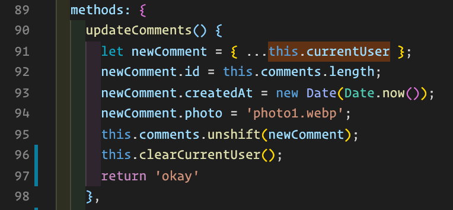
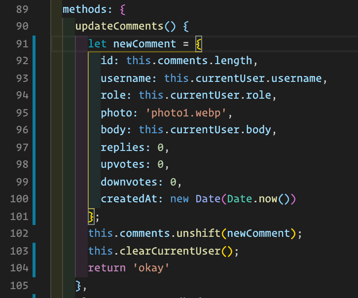
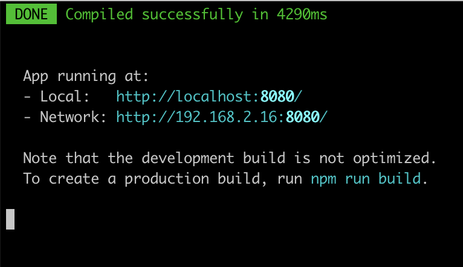
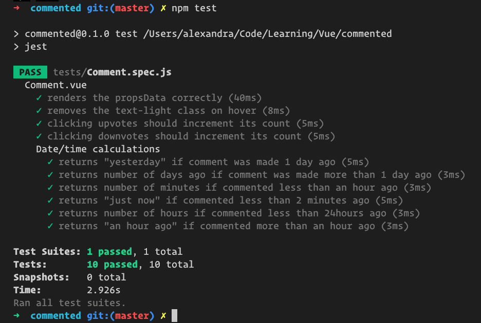

# What I just Learned...

After blowing away the node_modules, some research and a LOT of `console.log` statements, I finally found the culprit: the spread operator! Did you know that the spread operator was only available in ES2018? I sure didn't!

Now, I've opted for a more traditional approach of building an object to insert into the comments array.

As well I did more research on what options might be best to have in my eslintrc for Vue projects and have updated it accordingly. This also brought to light some formatting preferences which I have used to update my templates in the single-file-components.

Thank you for presenting me with the opportunity to add a new item to my "I'm going to double check this..." list. Researching the fix was a good exercise!

###Confirmation:

After making these changes I again deleted the node_modules, compiled, ran the tests and confirmed in browser.

Compiled:

Tests Pass:

In-browser Test:

